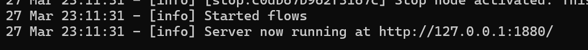

# Requirements:
install nodejs version above v18 . 

recomended nodejs version v22.14.0

# How to install node-red ?

git clone https://github.com/Suetra-ai/node-red.git

do cd ./node-red

npm install

npm start

you will see something like this:

open this url in a web browser:

 http://127.0.0.1:1880/

 ............................................

